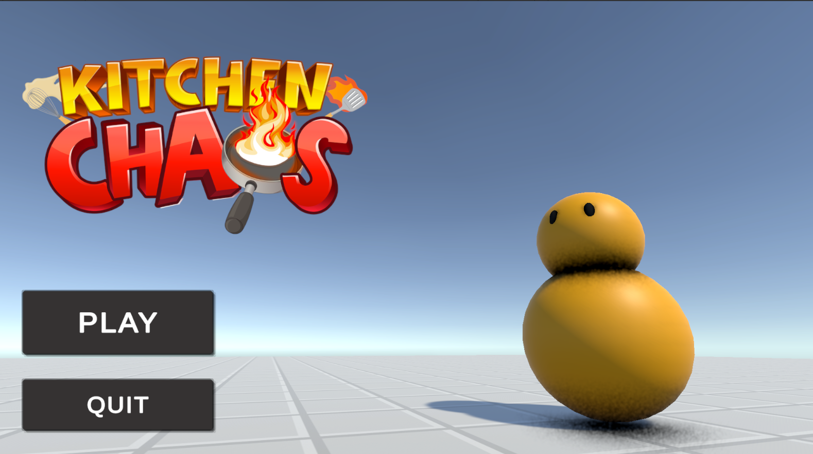
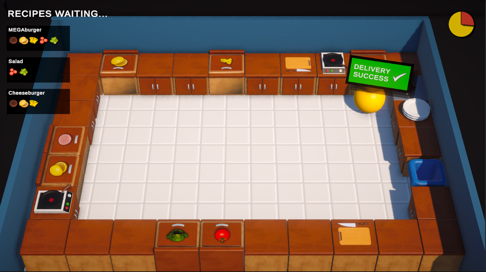

KTICHEN CHAOS SINGLE - PLAYER

Kitchen Chaos is a single-player, fast-paced cooking game developed using Unity.
This project was created by following CodeMonkey’s Kitchen Chaos tutorial series and extended with custom features for learning and improvement purposes.

ABOUT THE GAME

The player manages a kitchen and prepares different recipes under time pressure.
Ingredients must be collected, chopped, cooked, and combined correctly to complete customer orders and earn points.

The main goal is to complete as many correct orders as possible before time runs out.

TECHNOLOGIES USED
- Unity
- C#
- Unity Input System
- Scriptable Objects
- Event-driven architecture
FEATURES
- Single-player gameplay
- Recipe-based cooking system
- Ingredient interactions (pickup, chopping, cooking)
- Order system
- Basic UI and sound effects

CUSTOM FEATURES (NOT IN THE TURORIAL)
- Tutorial Screen Persistence
  - In the original tutorial, the tutorial screen is shown every time the game starts.
In this version, the tutorial screen is displayed only the first time the player launches the game.
After the player has seen it once, it will not appear again on subsequent game starts.

FUTURE IMPROVEMENTS
* Highest score (high score) system

HOW TO RUN THE PROJECT 

- Clone the repository,
- Open the project using Unity Hub (I used Unity 6000.0.36f1 version),
- Open the MainmMenuScene, press Play to start the game

NOTES

This project was developed for learning purposes by following a tutorial and enhancing it with personal improvements to better understand game development concepts.
